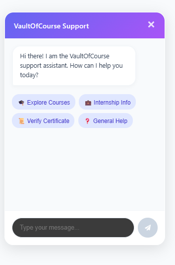

# VaultOfCourse AI Support Chatbot - Project Submission

**Repository:** [https://github.com/abhinavsai2006/vault-of-course-bot](https://github.com/abhinavsai2006/vault-of-course-bot)

## Overview
This project implements an AI-powered chatbot for the VaultOfCourse website, serving as a 24/7 first-level support and inquiry assistant. It utilizes the NVIDIA Nemotron model via an OpenAI-compatible API to deliver accurate, context-aware responses based strictly on a curated knowledge base.

---

## 1. Chatbot Interface
A fully responsive, premium chatbot interface was built using React and vanilla CSS (CSS Modules) to ensure flexibility and modern aesthetics (glassmorphism, micro-animations).

**Features Include:**
- Floating action button.
- Clean chat window with typing/loading indicators.
- Quick-action suggested questions (Explore Courses, Internship Info, Verify Certificate, General Help).
- Markdown rendering (bullet points, bold text, links) for professional readability.
- Clear WhatsApp escalation button when human intervention is required.

**Screenshots:**

---

## 2. System Architecture & Prompt Engineering

### Prompt Architecture
The system utilizes a structured prompt architecture designed to enforce constraints, prevent hallucination, and strictly bind the AI to the VaultOfCourse knowledge base.

- **Role:** VaultOfCourse website support assistant.
- **Responsibilities:** Answer common student queries, guide students to relevant pages, and redirect unresolved issues.
- **Restrictions:** Do not invent details, promise refunds, or claim issues are resolved. Do not use markdown tables (prefer bullet points).

### Intent Classification & Smart Routing
Intent classification is handled dynamically within the LLM's prompt logic. The model is instructed to identify if a query falls into specific categories requiring human support (e.g., `payment_query`, `offer_letter_query`, `technical_support`, `human_support`). 

When these intents are detected, the chatbot triggers a **Smart Route**:
It outputs a specific string `ESCALATE_TO_WHATSAPP`, which the frontend intercepts to render a clear escalation message alongside a functional WhatsApp Contact Support button.

---

## 3. Knowledge Base Integration
The knowledge base is stored locally in `src/lib/knowledge-base.json`. It contains verified information regarding:
- **Courses** (Ethical Hacking, Python, Full Stack)
- **Training Programs**
- **Internships**
- **FAQs** (Enrollment, Certificates)
- **Direct Website Page Routing**

The AI contextually parses this JSON to retrieve answers.

---

## 4. Conversation Memory
The application sends the entire conversation history (formatted as `system`, `user`, and `assistant` messages) in every API request. This allows the NVIDIA model to maintain context across turns (e.g., resolving pronouns like "its duration" to the previously discussed course).

---

## 5. Testing & Evaluation Report
A dedicated test dataset is provided in `tests/test-queries.json` covering 10+ edge cases and intents.

| Query Type | Intent Classification | Result |
| :--- | :--- | :--- |
| "What ethical hacking courses do you have?" | `course_inquiry` | Successfully routes to Ethical Hacking course info. |
| "Where can I download my certificate?" | `certificate_query` | Provides relevant knowledge base FAQ instructions. |
| "I paid but haven't received access." | `payment_query` | Successfully triggers WhatsApp escalation. |
| "I want to apply for an internship." | `internship_inquiry` | Provides internship roles and the direct application link. |
| "Who is the president?" | `unknown` | Refuses to hallucinate and escalates/redirects. |
| "My offer letter is incorrect." | `offer_letter_query` | Escalates to human support via WhatsApp. |

---

## Setup Instructions
1. Clone the repository from GitHub.
2. Run `npm install` to install dependencies (Next.js, React Markdown, OpenAI SDK).
3. Create a `.env.local` file and provide `NVIDIA_API_KEY` and `NVIDIA_BASE_URL`.
4. Run `npm run dev` and navigate to `http://localhost:3000`.

*Note: The `.env` and `.env.local` files are included in `.gitignore` to prevent credential leaks.*
